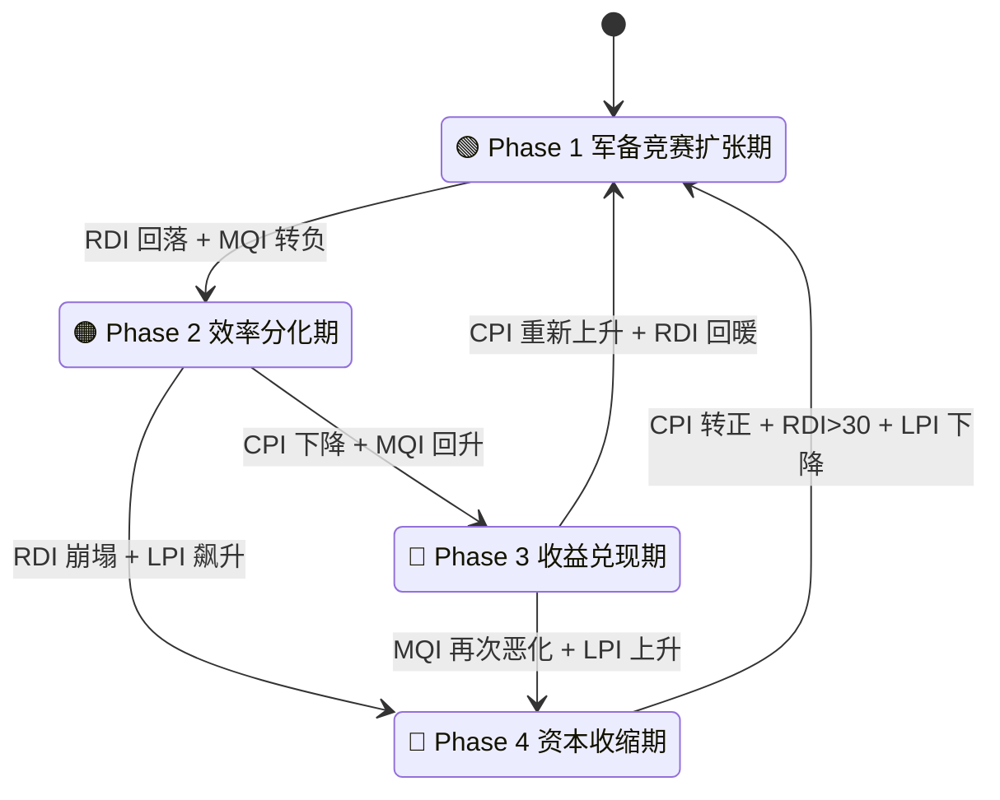
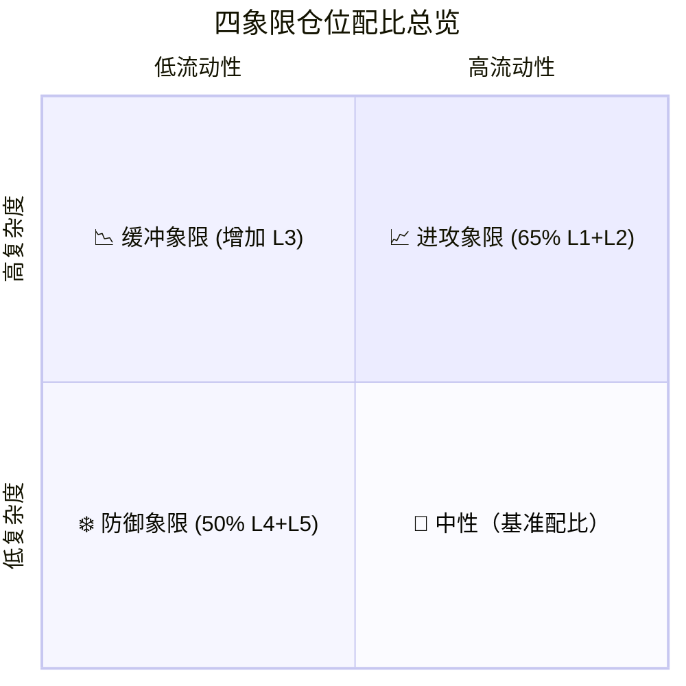
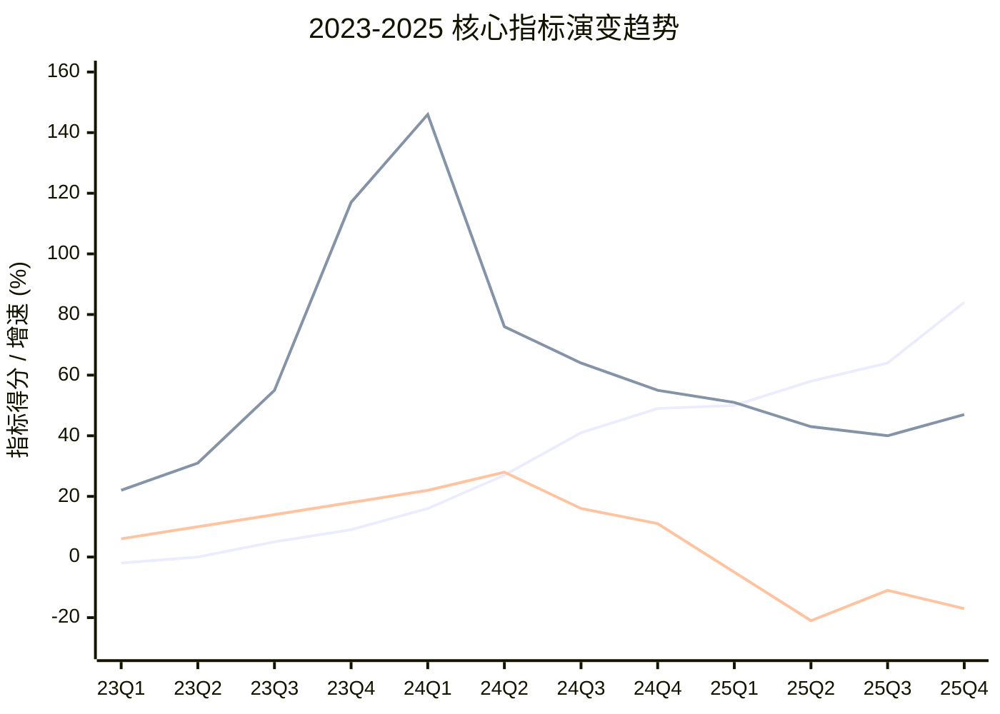

# AI Phase Transition Model（AIPT）

用五维指标判断 AI 基础设施周期相位，并自动映射到五层仓位结构。

---

## 📌 核心理念

本系统旨在衡量 AI 产业资本开支（CapEx）与收入增长之间的动态失衡。
类比物理中的“相变（Phase Transition）”，本模型通过量化指标捕捉产业从**疯狂扩张**到**效率分化**、再到**收益兑现**或**资本收缩**的相位转移。

**核心逻辑**：
- **CPI** = 投入动能（进攻）
- **RDI** = 需求验证（支撑）
- **MQI** = 利润质量（效率）
- 系统本质是在“增长（L2）”与“生存（L5）”之间进行动态资产配置。

---

## 🏗 第一部分：系统架构（原子组件）

在理解相位逻辑前，需明确模型操作的两大基础组件。

### 1.1 五层资产结构（L1-L5）
我们将资产按风险弹性从低到高分为 5 层，每一层在组合中承担不同的战略职能。

#### L1 核心平台层（长期收租层）
- **代表公司**：Microsoft · Amazon · Alphabet
- **特点**：AI + 云 + 现金流；不是最爆发，但长期胜率高。
- **角色**：组合基石。作为“收租者”，任何象限都必须保有一定比例，用稳定的现金流抵御周期。

#### L2 AI 引擎层（高弹性层）
- **代表公司**：NVIDIA
- **特点**：高波动 · 高成长 · 对流动性极敏感。
- **角色**：进攻主力。这是获取超额收益（Alpha）的核心，随周期相位大幅增减。

#### L3 电力与基础设施层（缓冲层）
- **代表公司**：Constellation Energy · NextEra Energy
- **逻辑**：AI 扩张的“能源支撑”。波动通常低于 L2，但能稳健受益于 AI 资本开支的持续投入。

#### L4 防御现金流层
- **涵盖**：必需消费 · 医疗 · 宽基指数 · 高股息 ETF
- **功能**：降低组合整体波动，在 Phase 2 效率分化及之后逐步增加。

#### L5 现金 / 宏观对冲层
- **涵盖**：现金 · 短债 · 长债
- **功能**：应对第四象限（资本收缩期），提供再部署弹药，是生存的底线。

---

### 1.2 五维指标体系（Sensors）
系统通过以下传感器实时感知市场相位：

| 指标 | 全称 | 含义概要 | 计算逻辑 | 阈值 / 信号 |
|:---:|:---|:---|:---|:---|
| **CPI** | **CapEx 动能指数** | 投入强度 | CapEx 增速 − 收入增速 | >20%: 军备竞赛；<0: 收缩 |
| **RDI** | **需求兑现指数** | 需求厚度 | (云增速 + 数据中心增速) / 2 | >40%: 强需求；<20%: 放缓 |
| **MQI** | **利润质量指数** | 运营效率 | 云利润率变化 + FCF 增速 | 上升: 效率提升；连续下降: 警报 |
| **LPI** | **流动性压力指数** | 宏观环境 | 10Y 利率变化 + 信用利差变化 | 上升: 收紧；下降: 宽松 |
| **PCI** | **价格确认指数** | 趋势验证 | 价格趋势 vs 200 日线 | ✅: 线上；❌: 线下（反转确认） |

---

## 🧠 第二部分：决策大脑（相位转移）

模型根据指标组合，将产业周期划分为四个相位。



### 相位特征详述

#### 🟢 Phase 1 — 军备竞赛扩张期

> **核心逻辑**：所有人都在疯狂建设，需求爆炸，不计成本。

| 维度 | 描述 |
|:---|:---|
| **核心特征** | CapEx 暴增、需求验证强劲、利润尚可、龙头股屡创新高 |
| **市场情绪** | 极度乐观 — “AI 改变一切”，FOMO 情绪主导 |
| **指标签名** | **CPI > 20**（花钱远超赚钱）· **RDI > 30**（需求火爆）· MQI 稳定 |
| **典型现象** | 财报超预期 → 股价暴涨；分析师竞相上调目标价；CapEx 指引超市场预期 |
| **历史参考** | 2023 Q2 – 2024 Q3（ChatGPT 引爆 → 主升浪浪潮） |
| **风险/机会** | 估值透支风险；L2 引擎层的黄金收割期 |

#### 🟠 Phase 2 — 效率分化期

> **核心逻辑**：钱花了很多，市场开始问“花得值不值？”指标出现严重背离。

| 维度 | 描述 |
|:---|:---|
| **核心特征** | CapEx 仍在加速，但收入增速跟不上；利润质量下降；龙头开始滞涨 |
| **市场情绪** | 怀疑渐起 — “利好不涨”；投资者开始聚焦回款周期与 ROIC |
| **指标签名** | **CPI > 20**（继续烧钱）· RDI 见顶回落 · **MQI 转负**（核心警报） |
| **典型现象** | 财报超预期但股价下挫；市场对 CapEx 指引表现出恐慌；“硬核买单”开始 |
| **当前状态** | 2024 Q4 至今（如 2026 年 2 月云厂商集体下跌事件） |
| **关键转折** | 效率优胜者与低效跟随者开始剧烈**分化** |

---

#### 🔵 Phase 3 — 收益兑现期

> **核心逻辑**：烧钱减速，由于规模效应和技术落地，胜出者开始收割利润。

| 维度 | 描述 |
|:---|:---|
| **核心特征** | CapEx 增速回落至正常区间；竞争格局清晰；存活者利润率显著回升 |
| **市场情绪** | 理性分化 — 龙头重获溢价，从“增长故事”转向“现金流故事” |
| **指标签名** | **CPI 0–10**（投入回归理性）· **MQI 上升**（利润质量回暖）· RDI 趋稳 |
| **典型现象** | 行业集中度大幅提升；回购增加；L1 平台展现极强定价权 |
| **历史参考** | 类似 2018–2019 云计算整合期 |
| **机会** | **L1 平台的黄金配置期**（低资本支出 + 高现金流 = 价值重估） |

---

#### 🔴 Phase 4 — 资本收缩期

> **核心逻辑**：需求证伪或宏观流动性枯竭，产业进入出清阶段。

| 维度 | 描述 |
|:---|:---|
| **核心特征** | CapEx 负增长；需求断崖式下跌；龙头跌破长期趋势；信用收紧 |
| **市场情绪** | 恐慌与悲观主导 — “AI 泡沫论”成为共识结论 |
| **指标签名** | **CPI < 0**（削减投资）· **RDI < 20**（需求崩塌）· **LPI 飙升**（流动性枯竭） |
| **典型现象** | 裁员潮；大规模砍单；龙头跌破 200 日线；系统性估值下修 |
| **操作策略** | **全面防御**（L4+L5 > 50%）；等待 CPI 转正与 RDI 回暖信号 |

---

## ⚙️ 第三部分：执行引擎（操作系统）

### 3.1 四象限仓位配比
根据流动性与产业复杂度，系统自动切换至对应仓位模式。



| 象限模式 | L1 核心 | L2 引擎 | L3 电力 | L4 防御 | L5 现金 | 特点描述 |
|:---|:---:|:---:|:---:|:---:|:---:|:---|
| **🔄 中性基准** | 30% | 20% | 15% | 20% | 15% | 稳健扩张结构 |
| **📈 进攻象限** | 35% | 30% | 15% | 10% | 10% | **进攻资产 (L1+L2) = 65%** |
| **📉 缓冲象限** | 30% | 15% | 20% | 20% | 15% | **保留平台 · 降低引擎 · 增加能源缓冲** |
| **❄️ 防御象限** | 20% | 10% | 20% | 30% | 20% | **防御资产 (L4+L5) = 50%** |

---

### 3.2 自动联动规则
- **总分下降 10 分**：L2 (引擎) −5% · L5 (现金) +5%
- **总分上升 10 分**：L2 (引擎) +5% · L5 (现金) −5%
- **核心原则**：L1 始终保持 20-35% 的核心底仓，仅在严重反转时调整。

---

### 3.3 渐进退出机制（Staged Exit）
顶部是一个过程，不是一个点。

1. **🟡 第一阶段：怀疑期**（利好不涨、龙头滞涨）→ L2 −5%, L5 +5%
2. **🟠 第二阶段：兑现放缓**（CapEx > 收入增速 20%、云利润下降）→ L2 再 −5%, L3 +5%
3. **🔴 第三阶段：结构反转**（增速断崖、跌破 200MA）→ L2 清仓, L1 −10%, L4/L5 +10%

---

## 📊 第四部分：实战验证与当前位置

### 4.1 季度指标跟踪 (2023-2025)

> **Phase 1 起点**：2023 Q1（ChatGPT 引爆 → 超大规模 CapEx 军备竞赛启动）  
> 数据来源：公司财报 + yfinance + 公开披露；部分早期数据为估算值（标 `*`）

#### 原始输入数据（Raw Inputs）

| 季度 | L1 CapEx 增速 | L1 收入增速 | 云收入增速 | DC 收入增速 | 云利润率 Δ | FCF 增速 | 10Y 利率 | 利率 Δ | NVDA vs 200MA |
|------|:---:|:---:|:---:|:---:|:---:|:---:|:---:|:---:|:---:|
| 2023 Q1 | +5 %* | +7 %* | +24 %* | +20 %* | +1 %* | +5 %* | 3.5 % | −0.4 | ✅ Above |
| 2023 Q2 | +8 %* | +8 %* | +26 %* | +35 %* | +2 %* | +8 %* | 3.8 % | +0.3 | ✅ Above |
| 2023 Q3 | +15 %* | +10 %* | +29 %* | +80 %* | +2 %* | +12 %* | 4.6 % | +0.8 | ✅ Above |
| 2023 Q4 | +22 % | +13 % | +28 % | +206 % | +3 % | +15 % | 3.9 % | −0.7 | ✅ Above |
| 2024 Q1 | +30 % | +14 % | +30 % | +262 % | +2 % | +20 % | 4.3 % | +0.4 | ✅ Above |
| 2024 Q2 | +42 % | +15 % | +29 % | +122 % | +3 % | +25 % | 4.3 % | 0.0 | ✅ Above |
| 2024 Q3 | +55 % | +14 % | +33 % | +94 % | +1 % | +15 % | 4.2 % | −0.1 | ✅ Above |
| 2024 Q4 | +63 % | +14 % | +31 % | +78 % | +1 % | +10 % | 4.6 % | +0.4 | ✅ Above |
| 2025 Q1 | +63 % | +13 % | +32 % | +69 % | +0 % | −5 % | 4.2 % | −0.4 | ⚠️ 接近 |
| 2025 Q2 | +72 % | +14 % | +33 % | +52 % | −1 % | −20 % | 4.3 % | +0.1 | ✅ Above |
| 2025 Q3 | +78 % | +14 % | +35 % | +44 % | −1 % | −10 % | 4.5 % | +0.2 | ✅ Above |
| 2025 Q4 | +100 %† | +16 % | +38 % | +55 % | −2 % | −15 % | 4.0 % | −0.5 | ✅ Above |

> † GOOGL 2026 年 CapEx 指引暴增（$175–185B），推高整体 L1 CapEx 增速。

#### 五维指标计算结果（Calculated Metrics）

| 季度 | CPI | RDI | MQI | LPI | PCI | 判定相位 |
|------|:---:|:---:|:---:|:---:|:---:|:---:|
| 2023 Q1 | −2 | 22 | +6 | −0.4 | 50 | ⬜ 前奏期 |
| 2023 Q2 | 0 | 31 | +10 | +0.3 | 50 | 🟢 Phase 1 启动 |
| 2023 Q3 | +5 | 55 | +14 | +0.8 | 50 | 🟢 Phase 1 加速 |
| 2023 Q4 | +9 | 117 | +18 | −0.7 | 50 | 🟢 Phase 1 巅峰 |
| 2024 Q1 | +16 | 146 | +22 | +0.4 | 50 | 🟢 Phase 1 |
| 2024 Q2 | +27 | 76 | +28 | 0.0 | 50 | 🟢 Phase 1 军备竞赛 |
| 2024 Q3 | +41 | 64 | +16 | −0.1 | 50 | 🟢 Phase 1 |
| 2024 Q4 | +49 | 55 | +11 | +0.4 | 50 | 🟡 Phase 1→2 |
| 2025 Q1 | +50 | 51 | −5 | −0.4 | 50 | 🟡 Phase 1→2 |
| 2025 Q2 | +58 | 43 | −21 | +0.1 | 50 | 🟠 Phase 2 初期 |
| 2025 Q3 | +64 | 40 | −11 | +0.2 | 50 | 🟠 Phase 2 |
| 2025 Q4 | +84 | 47 | −17 | −0.5 | 50 | 🟠 Phase 2 深化 |

#### 关键趋势可视化



> **Legend**: 🔵 **CPI** (投入动能 - 持续攀升) | 🟢 **RDI** (需求兑现 - 冲高回落) | 🟠 **MQI** (利润质量 - 转负预警)

#### 当前位置判断

- **CPI 极高**（84）：CapEx 增速远超收入增速 → 军备竞赛仍在加速，但效率已被全市场质疑。
- **RDI 稳健回落**（47）：需求增速从 2024 Q1 巅峰（146）大幅回落，目前仍保持在 40 警戒线之上，为系统提供底部支撑。
- **MQI 持续转负**（−17）：利润质量已连续 3 个季度恶化 → **Phase 2 核心信号已全面确认**。
- **LPI 暂维持中性**（−0.5）：利率暂未构成额外压力，流动性支撑尚在。
- **PCI 结构健康**（50）：NVDA 仍在 200 日线之上，价格结构尚未遭受破坏性重创。

> **结论**：当前处于 **Phase 2 效率分化期**。CPI/MQI 的巨大剪刀差说明投入远超回报，效率审判正在进行。  
> ⚠️ **预警**：若 RDI 跌破 40 + LPI 转正（利率收紧），将标志着向 Phase 3/4 的结构性大反转。

### 4.2 2025 年关键回撤节点回测

2026 年 2 月的大跌是失衡积累后的必然结果，而 2025 年的几次重大回撤则精准捕捉了模型从 **Phase 1 狂热向 Phase 2 审判** 转换的微观信号。

| 时间节点 | 市场事件 | AIPT 指标对照 | 验证结论 |
|:---|:---|:---|:---|
| **2025 Jan** | **DeepSeek 震撼发布**：引发对高昂推理费用的降维打击担忧，NVDA 单日跌 17% | **CPI = 50**：投入动能极高 | **泡沫敏感性极大化**：尽管需求仍在，但高投入背景下，任何扰动都会造成流动性踩踏 |
| **2025 Aug** | **MIT ROI 报告**：指出 95% 企业 AI 投入零回报，市场进入 Scrutiny 时期 | **MQI = -21**：全年效率最低点 | **效率审判开启**：市场逻辑从“买故事”彻底转向“看报表”，完全符合 Phase 2 定义 |
| **2025 Nov** | **泡沫共识深化**：BofA 调查显示 53% 投资者确信泡沫，OpenAI 巨损预测流出 | **CPI = 84**：军备竞赛过热至极限 | **极度风险预警**：模型显示“怀疑期”信号全满，确立了 v3.2 渐进退出的必要性 |

---

### 🔬 案例分析：2026 年 2 月云厂商集体下跌

> **2026-02-25 记录** — 事件回测验证模型预判精度

#### 事件概述
2026 年 2 月初，AMZN/MSFT/GOOGL 在财报季发布大额 CapEx 指引后股价重挫：
- **Amazon**：宣布 2026 年 $200B CapEx，两周跌 18%。
- **Microsoft**：单季 CapEx 同比增 89%，市场担忧 FCF 缩减。
- **市场共识**：军备竞赛投入远超短期收入回报，“硬核买单”阶段开启。

#### 指标回测对照表
| 指标 | 2025 Q4 信号 | 2 月现实验证 | 结论 |
|:---|:---:|:---|:---:|
| **CPI (84)** | 投入过热 | 巨额指引确认了扩张已进入后期狂热 | ✅ 极高匹配 |
| **MQI (-17)** | 利润质量负增长 | 投资者因现金流承压和回报不明而调减仓位 | ✅ 逻辑一致 |
| **RDI (47)** | 需求稳健 | 云收入仍保持 30%+ 增长，但无法支撑 100% 的 CapEx 增速 | ✅ 相位准确 |
| **v3.2 判定** | 怀疑期/兑现放缓 | 事件已触发“利好不涨”与“龙头滞涨”双重信号 | ✅ 成功减速 |

#### 案例深度结论
**模型预判与市场演进高度吻合。** 2025 Q4 判定的「Phase 2 深化」在 2 月得到了价格确认。这次下跌验证了 AIPT 的核心逻辑：当投入动能（CPI）与利润质量（MQI）的偏离积累到极限，市场必将通过大幅回撤来强制执行“效率审判”。

> 2 月的下跌不是意外，而是 CPI/MQI 失衡后的 **重力确认**。


## 🚀 实现与运行

### 代码结构说明
- `config.py`：配置模块，定义标的池（L1-L3）与五维指标的计算权重。
- `data_fetch.py`：数据获取模块，封装 yfinance 接口（可扩展接入 SEC 数据）。
- `indicators.py`：核心算法库，计算 CPI、RDI、MQI、LPI、PCI。
- `phase_classifier.py`：逻辑判定，划分周期相位。
- `allocation_mapper.py`：仓位映射，输出 L1-L5 指导比例。
- `report.py`：报告模块，负责可视化呈现。
- `main.py`：入口脚本，运行全流程分析。

### 快速启动
```bash
python3 -m venv .venv
source .venv/bin/activate
pip install -r requirements.txt
python main.py
```

---

## 📅 后续计划
- **自动化**：接入 SEC API 实时解析财报数据，消除手动输入。
- **工具化**：开发 Streamlit Dashboard，实现实时动态看板。
- **回测系统**：构建历史周期校验模块，进一步优化 PCI 判定逻辑。
