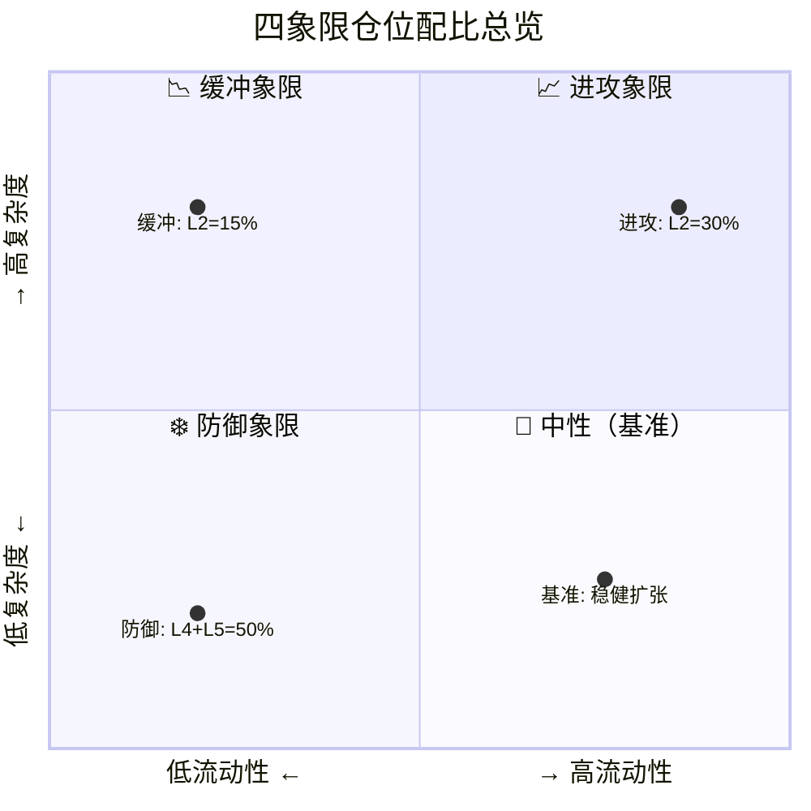

# AI Phase Transition Model（AIPT）

用五维指标判断 AI 基础设施周期相位，并自动映射到五层仓位结构。

---

## 命名由来

本仓库采用 **相位转移理论风格** 的命名：

- **全称**：AI Phase Transition Model  
- **简称**：AIPT  
- **含义**：类比物理中的相变——从扩张→收缩、从泡沫→坍塌、从无序→有序  

---

## 模型概览（v1.0 相位雷达）

用 **5 个核心变量**（CPI / RDI / MQI / LPI / PCI）判断当前处于哪一**周期相位**，并给出 **L1～L5 五层仓位** 建议。

### 四相位定义

| 阶段     | 名称           |
|----------|----------------|
| Phase 1  | 军备竞赛扩张期 |
| Phase 2  | 效率分化期     |
| Phase 3  | 收益兑现期     |
| Phase 4  | 资本收缩期     |

### 五维指标

| 指标 | 全称             | 含义概要                         | 简要判断 |
|------|------------------|----------------------------------|----------|
| CPI  | CapEx 动能指数   | CapEx 增速 − 收入增速            | >20% 军备竞赛，0～20% 正常扩张，<0 收缩 |
| RDI  | 需求兑现指数     | 云收入增速 + 数据中心收入增速    | >40% 强需求，25～40% 健康，<20% 放缓   |
| MQI  | 利润质量指数     | 云利润率变化 + FCF 增速          | 上升=效率提升，连续下降=警报           |
| LPI  | 流动性压力指数   | 10Y 利率 + 信用利差变化          | 上升=收紧，下降=宽松                   |
| PCI  | 价格确认指数     | 龙头新高 + 200 日线 + 财报后反应  | 综合价格确认                           |

### 相位判断与仓位映射

| 相位     | 典型条件                     | 建议仓位（L1～L5）     |
|----------|-----------------------------|------------------------|
| Phase 1  | CPI>20, RDI>30, MQI 稳定    | 35, 30, 15, 10, 10    |
| Phase 2  | CPI>20, RDI 下降, MQI 分化  | 30, 15, 20, 20, 15    |
| Phase 3  | CPI 0～10, MQI 上升         | 40, 10, 15, 20, 15    |
| Phase 4  | CPI<0, RDI<20, LPI 上升     | 20, 5, 20, 30, 25     |

---

## 🧠 五层资产结构模型

我们把资产分为 **5 层**，从进攻到防御依次排列：

### L1 核心平台层（长期收租层）

| 属性 | 说明 |
|------|------|
| **代表公司** | Microsoft · Amazon · Alphabet |
| **特点** | AI + 云 + 现金流；不是最爆发，但长期胜率高 |
| **角色** | 组合基石，任何象限都保有一定比例 |

### L2 AI 引擎层（高弹性层）

| 属性 | 说明 |
|------|------|
| **代表公司** | NVIDIA |
| **特点** | 高波动 · 高成长 · 对流动性极敏感 |
| **角色** | 进攻主力，随周期大幅增减 |

### L3 电力与基础设施层（缓冲层）

| 属性 | 说明 |
|------|------|
| **代表公司** | Constellation Energy · NextEra Energy |
| **逻辑** | AI 扩张的"能源支撑"，波动低于 L2 但仍受益于 AI 资本开支 |

### L4 防御现金流层

| 属性 | 说明 |
|------|------|
| **涵盖** | 必需消费 · 医疗 · 宽基指数 · 高股息 ETF |
| **功能** | 降低组合整体波动 |

### L5 现金 / 宏观对冲层

| 属性 | 说明 |
|------|------|
| **涵盖** | 现金 · 短债 · 长债 |
| **功能** | 应对第四象限（资本收缩期），提供再部署弹药 |

---

## 📊 四象限仓位配比



> **横轴**：流动性（宽松 → 收紧）｜**纵轴**：AI 产业复杂度（低 → 高）  
> 当前位置更接近 **📉 高复杂度 × 低流动性（缓冲象限）**

### 基准结构（中性象限）

> 总评分 80–95（当前约 81）— **稳健扩张结构**

| 层级 | 配比 |
|------|------|
| L1 核心平台 | 30 % |
| L2 AI 引擎 | 20 % |
| L3 电力基建 | 15 % |
| L4 防御层 | 20 % |
| L5 现金对冲 | 15 % |

### 📈 高复杂度 × 高流动性（进攻象限）

| 层级 | 配比 |
|------|------|
| L1 | 35 % |
| L2 | 30 % |
| L3 | 15 % |
| L4 | 10 % |
| L5 | 10 % |

> 进攻资产（L1 + L2）= **65 %**

### 📉 高复杂度 × 低流动性（当前更接近）

| 层级 | 配比 |
|------|------|
| L1 | 30 % |
| L2 | 15 % |
| L3 | 20 % |
| L4 | 20 % |
| L5 | 15 % |

> 保留平台 · 降低引擎 · 增加能源缓冲

### ❄️ 低复杂度 × 低流动性（防御象限）

| 层级 | 配比 |
|------|------|
| L1 | 20 % |
| L2 | 10 % |
| L3 | 20 % |
| L4 | 30 % |
| L5 | 20 % |

> 防御资产（L4 + L5）= **50 %**

---

## 🔥 自动联动规则

| 事件 | L2 变化 | L5 变化 |
|------|---------|---------|
| 总分 **下降 10 分** | −5 % | +5 % |
| 总分 **上升 10 分** | +5 % | −5 % |

> **L1 保持稳定**——它是长期核心。  
> 系统本质：**在进攻（L2）与生存（L5）之间动态切换**。

---

## 🏗 AI 产业资本模型 v3.2（顶部识别 & 渐进退出）

### 核心理念

> 系统不是预测顶部。  
> 系统是：**在结构恶化前逐步减速。**  
> 顶部不是一个点，是一个过程——你要做的是在这个过程里**逐层降低弹性**。

### 🟡 第一阶段：怀疑期

**触发条件**（任意 2 条）：

- 利好不涨
- 龙头滞涨
- 估值压缩
- 成交量下降

**动作**：L2 −5 % → L5 +5 %

### 🟠 第二阶段：兑现期放缓

**触发条件**（任意 2 条）：

- CapEx > 收入增速 20 %+
- 云利润率下降
- 订单增速放缓

**动作**：L2 再 −5 % → L3 +5 %

### 🔴 第三阶段：结构反转

**触发条件**（3 条以上）：

- 增速断崖
- 利润率连续下滑
- 宏观流动性收紧
- 龙头跌破长期趋势

**动作**：L2 清仓 · L1 −10 % · L4 +10 % · L5 +10 %

### ❄️ 防御象限最终结构

| L1 | L2 | L3 | L4 | L5 |
|----|----|----|----|----|
| 20 % | 5–10 % | 20 % | 30 % | 20–25 % |

### 📊 关键指标监控面板（季度必看）

| 指标 | 观察维度 |
|------|----------|
| 云收入增速 | 需求侧 |
| 数据中心增速 | 硬件侧 |
| ROIC | 资本效率 |
| CapEx 增速 | 投入强度 |
| FCF 增速 | 现金质量 |
| 利率趋势 | 宏观流动性 |

### v3.2 核心升级总结

- **v3.1**：结构模型（五层 + 四象限）
- **v3.2**：加入**顶部识别与渐进退出机制**（怀疑期 → 兑现放缓 → 结构反转）

---

### 实现与运行

**代码结构**（仓库根目录）：

```
config.py            # 配置（标的、权重）
data_fetch.py        # 数据获取（yfinance，可替换为 API）
indicators.py        # 五维指标计算
phase_classifier.py  # 相位分类 classify_phase()
allocation_mapper.py # 仓位映射 allocation_by_phase()
report.py            # 报告输出
main.py              # 入口（当前为手动测试值）
```

**运行**（建议使用虚拟环境）：

```bash
python3 -m venv .venv
.venv/bin/pip install -r requirements.txt
.venv/bin/python main.py
```

---

## 当前阶段（2026 早期）

CapEx 仍高、云增速尚可、利润压力出现、龙头波动加大 → 更接近 **Phase 1 → Phase 2 过渡**（军备竞赛后段，效率开始被市场审视）。

---

## 后续升级方向

- 自动抓财报（SEC / AlphaVantage / FinancialModelingPrep）
- 回测模块（历史周期校验）
- 可视化仪表盘（Streamlit）
- 情绪 / 期权数据接入
