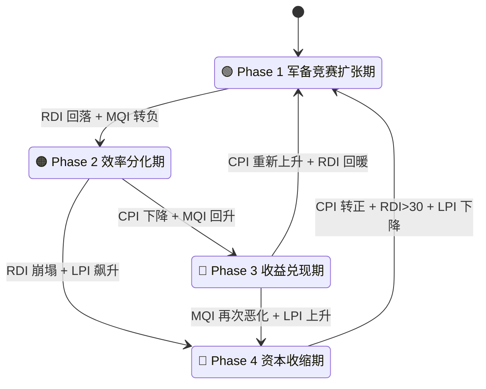
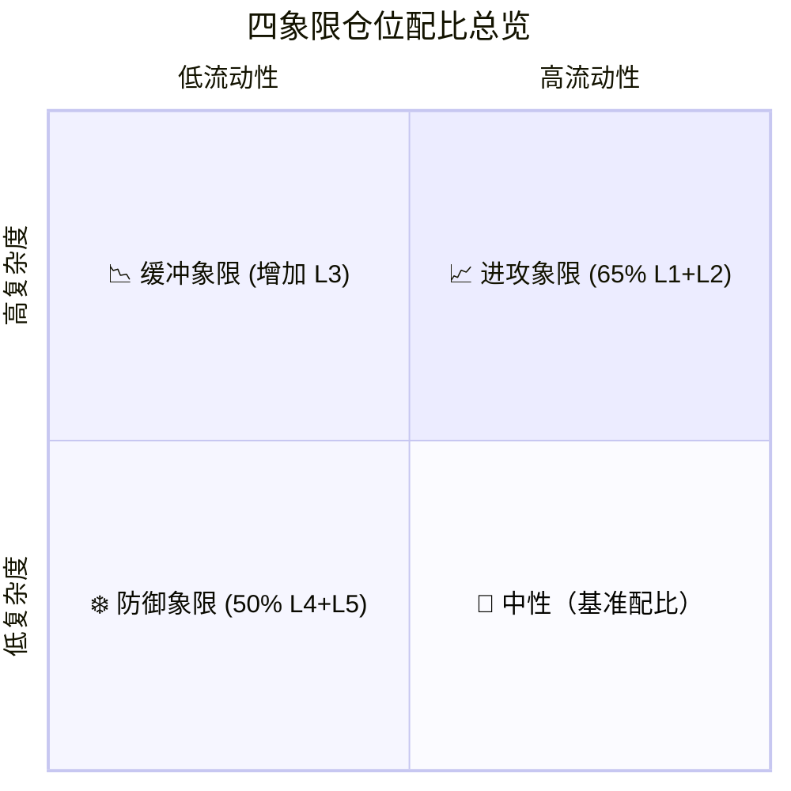

# AI Phase Transition Model（AIPT）

用五维指标判断 AI 基础设施周期相位，并自动映射到五层仓位结构。

---

## 📌 核心理念

本系统旨在衡量 AI 产业资本开支（CapEx）与收入增长之间的动态失衡。
类比物理中的“相变（Phase Transition）”，本模型通过量化指标捕捉产业从**疯狂扩张**到**效率分化**、再到**收益兑现**或**资本收缩**的相位转移。

**核心逻辑**：
- **CPI** = 投入动能（进攻）
- **RDI** = 需求验证（支撑）
- **MQI** = 利润质量（效率）
- 系统本质是在“增长（L2）”与“生存（L5）”之间进行动态资产配置。

---

## 🏗 第一部分：系统架构（原子组件）

在理解相位逻辑前，需明确模型操作的两大基础组件。

### 1.1 五层资产结构（L1-L5）
我们将资产按风险弹性从低到高分为 5 层：

| 层级 | 定义 | 特征 | 代表 / 涵盖 |
|:---:|:---|:---|:---|
| **L1** | **核心平台层** | AI+云+现金流，长期收租 | Microsoft, Amazon, Alphabet |
| **L2** | **AI 引擎层** | 高弹性、高成长、流动性敏感 | NVIDIA |
| **L3** | **电力基建层** | AI 扩张的能源支撑 | Constellation Energy, NextEra Energy |
| **L4** | **防御现金流层** | 降低波动 | 必需消费, 医疗, 宽基指数, 高股息 ETF |
| **L5** | **现金 / 宏观对冲** | 风险缓冲与再部署弹药 | 现金, 短债, 长债 |

---

### 1.2 五维指标体系（Sensors）
系统通过以下传感器实时感知市场相位：

| 指标 | 全称 | 计算逻辑 | 阈值 / 信号 |
|:---:|:---|:---|:---|
| **CPI** | **CapEx 动能指数** | CapEx 增速 − 收入增速 | >20%: 军备竞赛；<0: 资本收缩 |
| **RDI** | **需求兑现指数** | (云增速 + 数据中心增速) / 2 | >40%: 强需求；<20%: 需求放缓 |
| **MQI** | **利润质量指数** | 利润率变化 + FCF 增速 | 上升: 效率提升；连续下降: 警报 |
| **LPI** | **流动性压力指数** | 10Y 利率变化 + 信用利差变化 | 上升: 收紧；下降: 宽松 |
| **PCI** | **价格确认指数** | 价格 vs 200 日线 | ✅: 线上；❌: 线外（趋势反转） |

---

## 🧠 第二部分：决策大脑（相位转移）

模型根据指标组合，将产业周期划分为四个相位。



### 相位特征详述

#### 🟢 Phase 1 — 军备竞赛扩张期
- **核心**：所有人都在疯狂建设，需求爆炸，不计成本。
- **特征**：CPI > 20, RDI > 30, MQI 稳定。
- **市场**：极度乐观（FOMO），财报超预期 → 股价暴涨。

#### 🟠 Phase 2 — 效率分化期
- **核心**：钱花了很多，市场开始问“花得值不值？”
- **特征**：CPI 持续高企, RDI 见顶回落, **MQI 转负**。
- **市场**：怀疑渐起（利好不涨），投资者聚焦 ROIC 和 FCF。

#### 🔵 Phase 3 — 收益兑现期
- **核心**：烧钱减速，胜出者收割利润。
- **特征**：CPI 回落, MQI 上升, RDI 趋稳。
- **市场**：理性分化，L1 平台重获溢价，进入长期配置期。

#### 🔴 Phase 4 — 资本收缩期
- **核心**：需求证伪，流动性收紧，全面减速。
- **特征**：CPI < 0, RDI < 20, LPI 飙升。
- **市场**：恐慌悲观，跌破 200 日线，进入现金对冲期。

---

## ⚙️ 第三部分：执行引擎（操作系统）

### 3.1 四象限仓位配比
根据流动性与产业复杂度，系统自动切换至对应仓位模式。



| 仓位模式 | L1 核心 | L2 引擎 | L3 电力 | L4 防御 | L5 现金 | 适用场景 |
|:---:|:---:|:---:|:---:|:---:|:---:|:---|
| **基准型** | 30% | 20% | 15% | 20% | 15% | 中性象限 |
| **进攻型** | 35% | 30% | 15% | 10% | 10% | 高流动性 × 高复杂度 |
| **缓冲型** | 30% | 15% | 20% | 20% | 15% | 效率分化期（当前） |
| **防御型** | 20% | 10% | 20% | 30% | 20% | 资本收缩期 |

---

### 3.2 自动联动规则
- **总分下降 10 分**：L2 (引擎) −5% · L5 (现金) +5%
- **总分上升 10 分**：L2 (引擎) +5% · L5 (现金) −5%
- **核心原则**：L1 始终保持 20-35% 的核心底仓，仅在严重反转时调整。

---

### 3.3 v3.2 渐进退出机制（Staged Exit）
顶部是一个过程，不是一个点。

1. **🟡 第一阶段：怀疑期**（利好不涨、龙头滞涨）→ L2 −5%, L5 +5%
2. **🟠 第二阶段：兑现放缓**（CapEx > 收入增速 20%、云利润下降）→ L2 再 −5%, L3 +5%
3. **🔴 第三阶段：结构反转**（增速断崖、跌破 200MA）→ L2 清仓, L1 −10%, L4/L5 +10%

---

## 📊 第四部分：实战验证与当前位置

### 4.1 季度指标跟踪 (2023-2025)

| 季度 | CPI | RDI | MQI | 判定相位 |
|:---:|:---:|:---:|:---:|:---:|
| **2024 Q1** | +16 | 146 | +22 | 🟢 Phase 1 |
| **2024 Q4** | +49 | 55 | +11 | 🟡 Phase 1→2 |
| **2025 Q4** | **+84** | 47 | **−17** | **🟠 Phase 2 深化** |

> **当前结论**：已进入 **Phase 2 效率分化期**。CPI 持续飙升但 MQI 连续转负，确认“投入远超回报”特征。

### 🔬 案例：2026 年 2 月云厂商集体下跌
2026 年 2 月，AMZN/MSFT/GOOGL 因大额 CapEx 指引导致股价重挫。这验证了 AIPT 的核心预判：当 CPI 飙升与 MQI 恶化同时出现，市场迟早会通过价格确认 Phase 2 的效率审判。

---

## 🚀 实现与运行

### 代码结构
- `config.py`: 配置（标的、权重）
- `indicators.py`: 五维指标计算逻辑
- `phase_classifier.py`: 相位分类器
- `allocation_mapper.py`: 仓位映射逻辑

### 快速启动
```bash
python3 -m venv .venv
source .venv/bin/activate
pip install -r requirements.txt
python main.py
```

---

## 📅 后续计划
- 自动抓取 SEC 财报数据
- 回测模块与 Streamlit 可视化面板
