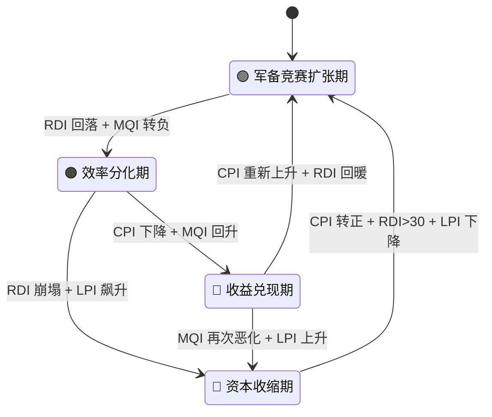
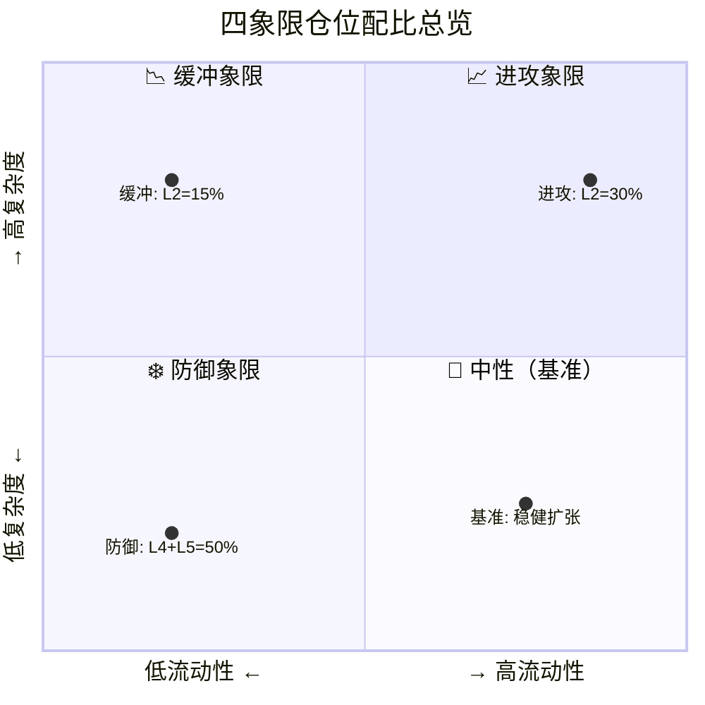

# AI Phase Transition Model（AIPT）

用五维指标判断 AI 基础设施周期相位，并自动映射到五层仓位结构。

---

## 命名由来

本仓库采用 **相位转移理论风格** 的命名：

- **全称**：AI Phase Transition Model  
- **简称**：AIPT  
- **含义**：类比物理中的相变——从扩张→收缩、从泡沫→坍塌、从无序→有序  

---

## 模型概览（v1.0 相位雷达）

用 **5 个核心变量**（CPI / RDI / MQI / LPI / PCI）判断当前处于哪一**周期相位**，并给出 **L1～L5 五层仓位** 建议。

### 四相位定义



---

#### 🟢 Phase 1 — 军备竞赛扩张期

> **一句话**：所有人都在疯狂建设，需求爆炸，不计成本。

| 维度 | 描述 |
|------|------|
| **核心特征** | CapEx 暴增、需求验证强劲、利润尚可、龙头股屡创新高 |
| **市场情绪** | 极度乐观 — "AI 改变一切"，FOMO 驱动 |
| **指标特征** | CPI > 20（花钱远超赚钱）· RDI > 30（需求火爆）· MQI 稳定或上升 |
| **典型现象** | 财报超预期 → 股价暴涨；分析师竞相上调目标价；CapEx 指引超市场预期 |
| **历史类比** | 2023 Q2 – 2024 Q3（ChatGPT 引爆 → NVDA 从 $20 涨到 $130+） |
| **风险** | 估值透支、一旦需求放缓就会剧烈调整 |

---

#### 🟠 Phase 2 — 效率分化期

> **一句话**：钱花了很多，但市场开始问"花得值不值？"

| 维度 | 描述 |
|------|------|
| **核心特征** | CapEx 仍在加速，但收入增速跟不上；利润质量下降；龙头开始滞涨 |
| **市场情绪** | 怀疑渐起 — 财报超预期但股价不涨甚至下跌 |
| **指标特征** | CPI > 20（继续烧钱）· RDI 回落（需求增速放缓）· **MQI 转负**（利润被侵蚀） |
| **典型现象** | "利好不涨"；投资者开始聚焦 ROIC 和 FCF；CapEx 指引吓坏市场 |
| **历史类比** | 2024 Q4 – **当前**（CPI=84 但 MQI=−17，2026 年 2 月云厂商集体暴跌） |
| **关键转折** | 效率好的公司（利润率提升）与效率差的公司开始**分化** |

---

#### 🔵 Phase 3 — 收益兑现期

> **一句话**：烧钱减速了，活下来的公司开始收割利润。

| 维度 | 描述 |
|------|------|
| **核心特征** | CapEx 增速回落至正常区间；竞争格局清晰；存活者利润率回升 |
| **市场情绪** | 理性分化 — 龙头重获溢价，尾部公司被抛弃 |
| **指标特征** | CPI 0–10（投入趋于理性）· **MQI 上升**（利润质量改善）· RDI 稳定 |
| **典型现象** | 行业集中度提升；回购增加；从"增长故事"转向"现金流故事" |
| **历史类比** | 类似 2018–2019 云计算整合期（AWS/Azure 利润率稳步提升） |
| **机会** | L1 核心平台的**黄金配置期**（低 CapEx + 高利润 = 价值重估） |

---

#### 🔴 Phase 4 — 资本收缩期

> **一句话**：需求证伪，流动性收紧，全面防御。

| 维度 | 描述 |
|------|------|
| **核心特征** | CapEx 负增长；需求断崖；龙头跌破长期趋势；信用收紧 |
| **市场情绪** | 恐慌 / 悲观 — "AI 是泡沫"叙事重现 |
| **指标特征** | CPI < 0（削减投资）· RDI < 20（需求崩塌）· **LPI 上升**（流动性枯竭） |
| **典型现象** | 裁员潮；项目砍单；龙头股跌破 200 日线；信用利差扩大 |
| **历史类比** | 2022 加息周期（科技股腰斩、Meta/NVDA 大幅回调） |
| **操作** | L4 + L5 = 50%+；等待 CPI 转正 + RDI 回暖信号再重新进攻 |


### 五维指标

| 指标 | 全称             | 含义概要                         | 简要判断 |
|------|------------------|----------------------------------|----------|
| CPI  | CapEx 动能指数   | CapEx 增速 − 收入增速            | >20% 军备竞赛，0～20% 正常扩张，<0 收缩 |
| RDI  | 需求兑现指数     | 云收入增速 + 数据中心收入增速    | >40% 强需求，25～40% 健康，<20% 放缓   |
| MQI  | 利润质量指数     | 云利润率变化 + FCF 增速          | 上升=效率提升，连续下降=警报           |
| LPI  | 流动性压力指数   | 10Y 利率 + 信用利差变化          | 上升=收紧，下降=宽松                   |
| PCI  | 价格确认指数     | 龙头新高 + 200 日线 + 财报后反应  | 综合价格确认                           |

### 相位判断与仓位映射

| 相位     | 典型条件                     | 建议仓位（L1～L5）     |
|----------|-----------------------------|------------------------|
| Phase 1  | CPI>20, RDI>30, MQI 稳定    | 35, 30, 15, 10, 10    |
| Phase 2  | CPI>20, RDI 下降, MQI 分化  | 30, 15, 20, 20, 15    |
| Phase 3  | CPI 0～10, MQI 上升         | 40, 10, 15, 20, 15    |
| Phase 4  | CPI<0, RDI<20, LPI 上升     | 20, 5, 20, 30, 25     |

---

## 🧠 五层资产结构模型

我们把资产分为 **5 层**，从进攻到防御依次排列：

### L1 核心平台层（长期收租层）

| 属性 | 说明 |
|------|------|
| **代表公司** | Microsoft · Amazon · Alphabet |
| **特点** | AI + 云 + 现金流；不是最爆发，但长期胜率高 |
| **角色** | 组合基石，任何象限都保有一定比例 |

### L2 AI 引擎层（高弹性层）

| 属性 | 说明 |
|------|------|
| **代表公司** | NVIDIA |
| **特点** | 高波动 · 高成长 · 对流动性极敏感 |
| **角色** | 进攻主力，随周期大幅增减 |

### L3 电力与基础设施层（缓冲层）

| 属性 | 说明 |
|------|------|
| **代表公司** | Constellation Energy · NextEra Energy |
| **逻辑** | AI 扩张的"能源支撑"，波动低于 L2 但仍受益于 AI 资本开支 |

### L4 防御现金流层

| 属性 | 说明 |
|------|------|
| **涵盖** | 必需消费 · 医疗 · 宽基指数 · 高股息 ETF |
| **功能** | 降低组合整体波动 |

### L5 现金 / 宏观对冲层

| 属性 | 说明 |
|------|------|
| **涵盖** | 现金 · 短债 · 长债 |
| **功能** | 应对第四象限（资本收缩期），提供再部署弹药 |

---

## 📊 四象限仓位配比



> **横轴**：流动性（宽松 → 收紧）｜**纵轴**：AI 产业复杂度（低 → 高）  
> 当前位置更接近 **📉 高复杂度 × 低流动性（缓冲象限）**

### 基准结构（中性象限）

> 总评分 80–95（当前约 81）— **稳健扩张结构**

| 层级 | 配比 |
|------|------|
| L1 核心平台 | 30 % |
| L2 AI 引擎 | 20 % |
| L3 电力基建 | 15 % |
| L4 防御层 | 20 % |
| L5 现金对冲 | 15 % |

### 📈 高复杂度 × 高流动性（进攻象限）

| 层级 | 配比 |
|------|------|
| L1 | 35 % |
| L2 | 30 % |
| L3 | 15 % |
| L4 | 10 % |
| L5 | 10 % |

> 进攻资产（L1 + L2）= **65 %**

### 📉 高复杂度 × 低流动性（当前更接近）

| 层级 | 配比 |
|------|------|
| L1 | 30 % |
| L2 | 15 % |
| L3 | 20 % |
| L4 | 20 % |
| L5 | 15 % |

> 保留平台 · 降低引擎 · 增加能源缓冲

### ❄️ 低复杂度 × 低流动性（防御象限）

| 层级 | 配比 |
|------|------|
| L1 | 20 % |
| L2 | 10 % |
| L3 | 20 % |
| L4 | 30 % |
| L5 | 20 % |

> 防御资产（L4 + L5）= **50 %**

---

## 🔥 自动联动规则

| 事件 | L2 变化 | L5 变化 |
|------|---------|---------|
| 总分 **下降 10 分** | −5 % | +5 % |
| 总分 **上升 10 分** | +5 % | −5 % |

> **L1 保持稳定**——它是长期核心。  
> 系统本质：**在进攻（L2）与生存（L5）之间动态切换**。

---

## 🏗 AI 产业资本模型 v3.2（顶部识别 & 渐进退出）

### 核心理念

> 系统不是预测顶部。  
> 系统是：**在结构恶化前逐步减速。**  
> 顶部不是一个点，是一个过程——你要做的是在这个过程里**逐层降低弹性**。

### 🟡 第一阶段：怀疑期

**触发条件**（任意 2 条）：

- 利好不涨
- 龙头滞涨
- 估值压缩
- 成交量下降

**动作**：L2 −5 % → L5 +5 %

### 🟠 第二阶段：兑现期放缓

**触发条件**（任意 2 条）：

- CapEx > 收入增速 20 %+
- 云利润率下降
- 订单增速放缓

**动作**：L2 再 −5 % → L3 +5 %

### 🔴 第三阶段：结构反转

**触发条件**（3 条以上）：

- 增速断崖
- 利润率连续下滑
- 宏观流动性收紧
- 龙头跌破长期趋势

**动作**：L2 清仓 · L1 −10 % · L4 +10 % · L5 +10 %

### ❄️ 防御象限最终结构

| L1 | L2 | L3 | L4 | L5 |
|----|----|----|----|----|
| 20 % | 5–10 % | 20 % | 30 % | 20–25 % |

### 📊 关键指标监控面板（季度必看）

| 指标 | 观察维度 |
|------|----------|
| 云收入增速 | 需求侧 |
| 数据中心增速 | 硬件侧 |
| ROIC | 资本效率 |
| CapEx 增速 | 投入强度 |
| FCF 增速 | 现金质量 |
| 利率趋势 | 宏观流动性 |

### v3.2 核心升级总结

- **v3.1**：结构模型（五层 + 四象限）
- **v3.2**：加入**顶部识别与渐进退出机制**（怀疑期 → 兑现放缓 → 结构反转）

---

### 实现与运行

**代码结构**（仓库根目录）：

```
config.py            # 配置（标的、权重）
data_fetch.py        # 数据获取（yfinance，可替换为 API）
indicators.py        # 五维指标计算
phase_classifier.py  # 相位分类 classify_phase()
allocation_mapper.py # 仓位映射 allocation_by_phase()
report.py            # 报告输出
main.py              # 入口（当前为手动测试值）
```

**运行**（建议使用虚拟环境）：

```bash
python3 -m venv .venv
.venv/bin/pip install -r requirements.txt
.venv/bin/python main.py
```

---

## 当前阶段（2026 早期）

### 📋 Phase 1 以来季度指标跟踪

> **Phase 1 起点**：2023 Q1（ChatGPT 引爆 → 超大规模 CapEx 军备竞赛启动）  
> 数据来源：公司财报 + yfinance + 公开披露；部分早期数据为估算值（标 `*`）

#### 原始输入数据

| 季度 | L1 CapEx 增速 | L1 收入增速 | 云收入增速 | DC 收入增速 | 云利润率 Δ | FCF 增速 | 10Y 利率 | 利率 Δ | NVDA vs 200MA |
|------|:---:|:---:|:---:|:---:|:---:|:---:|:---:|:---:|:---:|
| 2023 Q1 | +5 %* | +7 %* | +24 %* | +20 %* | +1 %* | +5 %* | 3.5 % | −0.4 | ✅ Above |
| 2023 Q2 | +8 %* | +8 %* | +26 %* | +35 %* | +2 %* | +8 %* | 3.8 % | +0.3 | ✅ Above |
| 2023 Q3 | +15 %* | +10 %* | +29 %* | +80 %* | +2 %* | +12 %* | 4.6 % | +0.8 | ✅ Above |
| 2023 Q4 | +22 % | +13 % | +28 % | +206 % | +3 % | +15 % | 3.9 % | −0.7 | ✅ Above |
| 2024 Q1 | +30 % | +14 % | +30 % | +262 % | +2 % | +20 % | 4.3 % | +0.4 | ✅ Above |
| 2024 Q2 | +42 % | +15 % | +29 % | +122 % | +3 % | +25 % | 4.3 % | 0.0 | ✅ Above |
| 2024 Q3 | +55 % | +14 % | +33 % | +94 % | +1 % | +15 % | 4.2 % | −0.1 | ✅ Above |
| 2024 Q4 | +63 % | +14 % | +31 % | +78 % | +1 % | +10 % | 4.6 % | +0.4 | ✅ Above |
| 2025 Q1 | +63 % | +13 % | +32 % | +69 % | +0 % | −5 % | 4.2 % | −0.4 | ⚠️ 接近 |
| 2025 Q2 | +72 % | +14 % | +33 % | +52 % | −1 % | −20 % | 4.3 % | +0.1 | ✅ Above |
| 2025 Q3 | +78 % | +14 % | +35 % | +44 % | −1 % | −10 % | 4.5 % | +0.2 | ✅ Above |
| 2025 Q4 | +100 %† | +16 % | +38 % | +55 % | −2 % | −15 % | 4.0 % | −0.5 | ✅ Above |

> † GOOGL 2026 年 CapEx 指引暴增（$175–185B），推高整体 L1 CapEx 增速

#### 五维指标计算结果

| 季度 | CPI | RDI | MQI | LPI | PCI | 判定相位 |
|------|:---:|:---:|:---:|:---:|:---:|:---:|
| 2023 Q1 | −2 | 22 | +6 | −0.4 | 50 | ⬜ 前奏期 |
| 2023 Q2 | 0 | 31 | +10 | +0.3 | 50 | 🟢 Phase 1 启动 |
| 2023 Q3 | +5 | 55 | +14 | +0.8 | 50 | 🟢 Phase 1 加速 |
| 2023 Q4 | +9 | 117 | +18 | −0.7 | 50 | 🟢 Phase 1 巅峰 |
| 2024 Q1 | +16 | 146 | +22 | +0.4 | 50 | 🟢 Phase 1 |
| 2024 Q2 | +27 | 76 | +28 | 0.0 | 50 | 🟢 Phase 1 军备竞赛 |
| 2024 Q3 | +41 | 64 | +16 | −0.1 | 50 | 🟢 Phase 1 |
| 2024 Q4 | +49 | 55 | +11 | +0.4 | 50 | 🟡 Phase 1→2 |
| 2025 Q1 | +50 | 51 | −5 | −0.4 | 50 | 🟡 Phase 1→2 |
| 2025 Q2 | +58 | 43 | −21 | +0.1 | 50 | 🟠 Phase 2 初期 |
| 2025 Q3 | +64 | 40 | −11 | +0.2 | 50 | 🟠 Phase 2 |
| 2025 Q4 | +84 | 47 | −17 | −0.5 | 50 | 🟠 Phase 2 深化 |

> **CPI** = CapEx 增速 − 收入增速 ｜ **RDI** = (云增速 + DC 增速) / 2 ｜ **MQI** = 利润率 Δ + FCF 增速  
> **LPI** = 利率变化 ｜ **PCI** = NVDA 是否在 200 日线之上（50=是，0=否）

#### 关键趋势摘要

```
CPI: ─2 → 0 → 5 → 9 → 16 → 27 → 41 → 49 → 50 → 58 → 64 → 84  📈 持续攀升
RDI: 22 → 31 → 55 → 117 → 146 → 76 → 64 → 55 → 51 → 43 → 40 → 47  📉 从巅峰回落
MQI: +6 → +10 → +14 → +18 → +22 → +28 → +16 → +11 → -5 → -21 → -11 → -17  ⚠️ 已转负
LPI:               周期性波动，尚未持续收紧                              ↔️ 中性
PCI:               NVDA 持续在 200MA 之上                               ✅ 健康
```

### 当前判断

- **CPI 极高**（84）：CapEx 增速远超收入增速 → 军备竞赛仍在加速，但效率已被质疑
- **RDI 回落**（47）：需求增速从 2024 Q1 巅峰（146）大幅回落，尚未跌破 40 警戒线
- **MQI 持续为负**（−17）：利润质量已连续 3 个季度恶化 → **Phase 2 核心信号已确认**
- **LPI 中性**（−0.5）：利率暂未构成额外压力
- **PCI 健康**（50）：NVDA 仍在 200 日线之上，价格结构尚未破坏

> **结论**：已进入 **Phase 2 效率分化期**。CPI 持续飙升但 MQI 连续转负，说明 CapEx 军备竞赛的"投入远超回报"特征已确立。  
> ⚠️ **需要警惕 Phase 3 触发信号**：若 RDI 跌破 40 + MQI 持续恶化 + LPI 转正（利率收紧），则进入收益兑现期。

---

### 🔬 实战验证：2026 年 2 月云厂商集体下跌

> **2026-02-25 记录** — 用真实市场事件回测 AIPT 模型预判能力

#### 事件概述

2026 年 2 月初，三大云厂商在财报季后集体大幅下挫：

| 公司 | 跌幅 | 触发事件 |
|------|:---:|----------|
| Amazon | −18 %（两周蒸发 $4600 亿） | 宣布 2026 CapEx **$200B**（同比 +56%） |
| Microsoft | −18 % | 单季 CapEx $29.9B（同比 +89%），市场质疑回报周期 |
| Alphabet | −3 %+ | 指引 2026 CapEx **$175–185B**（接近翻倍） |

**市场核心恐慌**：CapEx 军备竞赛仍在猛烈加速，但收入增速远远跟不上 → 利润质量与自由现金流承压。

#### 模型指标对照

| AIPT 指标 | 2025 Q4 判定 | 2 月事件验证 | 吻合度 |
|-----------|:---:|----------|:---:|
| **CPI = 84** | CapEx 远超收入 | 三巨头 CapEx 指引再次暴增，CPI 预计突破 100 | ✅ 精确 |
| **MQI = −17** | 利润质量恶化 | 投资者正是因"花钱太多、回报不够快"抛售 | ✅ 精确 |
| **RDI = 47** | 需求回落但未崩 | 云收入仍增长，只是增速赶不上 CapEx | ✅ 一致 |
| **PCI = 50** | 龙头在 200MA 上 | 龙头暴跌但 NVDA 尚未跌破 200MA | ✅ 一致 |

#### v3.2 顶部识别验证

| 怀疑期触发条件 | 当前状态 |
|---------------|:---:|
| 🔴 **利好不涨** | 营收超预期但股价暴跌 |
| 🔴 **龙头滞涨** | AMZN/MSFT 各跌 18% |
| 🟡 估值压缩 | PE 重估正在发生 |
| ⬜ 成交量下降 | 待观察 |

> 4 条中已满足 **2–3 条** → **v3.2 怀疑期信号已触发**  
> 按规则应执行：**L2 −5% → L5 +5%**

#### 结论

**模型预判与市场走势高度吻合。** 2025 Q4 判定「Phase 2 深化」是正确的——2 月下跌不是意外，而是 CPI/MQI 剪刀差积累到一定程度后的 **市场价格确认**。这验证了 AIPT 模型的核心逻辑：

> 当 CapEx 增速持续远超收入增速（CPI 飙升）+ 利润质量转负（MQI 恶化），  
> 市场迟早会用价格来"确认"这一失衡 → Phase 2 效率审判。

---

## 后续升级方向

- 自动抓财报（SEC / AlphaVantage / FinancialModelingPrep）
- 回测模块（历史周期校验）
- 可视化仪表盘（Streamlit）
- 情绪 / 期权数据接入
