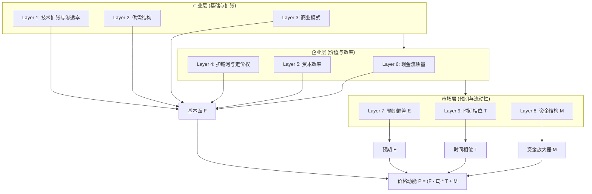

# AI 云产业资本效率模型
## 结构化投研框架：多周期、多层资本与多维博弈

### 核心哲学：从“技术驱动”转向“资本回报驱动”
在 AI 产业的高速扩张期，市场倾向于定价“可能性”；而在产业的中后期或波动期，市场则定价“确定性”。本模型旨在通过九层穿透式结构，将宏观流动性、中观产业逻辑与微观财务质量统一在同一个动态估值公式中。

---

## 第一部分：产业层 —— 扩张的确定性基石

### Layer 1：技术扩张与渗透率
*   **理论核心**：遵循创新扩散曲线（S-Curve）。AI 的核心逻辑在于其是否已越过“鸿沟”。
*   **关键指标**：
    *   **推理成本下降率**：推理成本能否降至传统方案的 1/10 是渗透率爆炸的阈值。
    *   **算力瓶颈与交付周期**：研究 GPU 交付周期的边际变化，判断扩张受限程度。
    *   **企业侧采纳率**：从实验性部署向生产级应用的转化效率。
*   **逻辑判定**：渗透率 < 20% 时，市场容忍低效率的扩张；渗透率 > 50% 时，估值逻辑将从“增长倍数”转向“现金流倍数”。

### Layer 2：产业供需结构
*   **理论核心**：分析产业链的“牛鞭效应”。
*   **供给侧分析**：GPU 总产能、带宽限制、先进封装产能。
*   **需求侧分类**：激进的超大规模云厂商、追赶型的主权 AI、以及谨慎的企业级 SaaS。
*   **判断点**：资本支出（CapEx）是否见顶？当供给端的扩张速度超过需求端的回报预期时，利润周期进入下行通道。

### Layer 3：商业模式结构
*   **理论核心**：区分“一次性建设收入”与“持续性现金流”。
    1.  **资源型 (算力租赁)**：通过规模效应降低边际成本，核心是出租率。
    2.  **能力型 (平台 API)**：通过模型性能产生溢价，核心是开发者生态。
    3.  **价值型 (垂直应用)**：通过解决垂直行业痛点提升客户粘性。
*   **核心逻辑**：商业模式决定了利润率的稳定性与扩张的边际成本。订阅化占比越高，确定性越强。

---

## 第二部分：企业层 —— 价值捕获的核心质量

### Layer 4：护城河与定价权
*   **理论核心**：AI 时代，“算法”是流沙，“数据闭环”与“分发渠道”是基石。
*   **护城河识别**：
    *   **数据网络效应**：用户反馈能否形成闭环。
    *   **高迁移成本**：应用层与企业业务流的深度嵌入。
    *   **成本领先**：自研芯片或极致的工程优化。
*   **判断点**：企业是否具备长期维持投入资本回报率 (ROIC) > 加权平均资本成本 (WACC) 的能力？

### Layer 5：资本效率
*   **理论核心**：衡量每一块钱投入产生的边际收益。
*   **关键指标**：
    *   **投入资本回报率 (ROIC)**：衡量资本分配的效率。
    *   **资本支出/收入比例**：在扩张阶段该比例通常较高，但回归常态的速度决定了估值弹性。
    *   **折旧压力分析**：算力硬件的快速更迭意味着极短的折旧周期，这对利润表是巨大的拖累。
*   **核心逻辑**：AI 投资最大的风险在于“回报滞后”与“过度投资”。

### Layer 6：现金流质量
*   **理论核心**：剥离会计水分，回归真实现金状况。
*   **审计要点**：
    *   **合同负债/预收款**：判断未来增长的“后劲”。
    *   **自由现金流转化为率**：撇除股权补偿与非经常性支出的真实造血能力。
    *   **依赖度分析**：收入是否过度依赖于单一“大客户”或“关联方”。
*   **逻辑判定**：健康的现金流是抵御极端市场环境的最后一道防线。

---

## 第三部分：市场层 —— 价格动能的非对称博弈

### Layer 7：预期偏差
*   **理论核心**：价格不反映“事实”，反映“事实与预期的差值”。
*   **定义公式**：预期偏差 = 实际增长 - 市场隐含增长率。
*   **风险预警**：当股价上涨速度远快于基本面改善时，隐含增长率被推至极端，任何“符合预期”的数据都可能引发抛售。

### Layer 8：资金结构
*   **理论核心**：资金不仅是价格的推动者，也是价格的“波动放大器”。
*   **特征分类**：
    1.  **基石资金**：被动指数型与养老基金。
    2.  **博弈资金**：主动型对冲基金与通过杠杆布局的散户。
    3.  **衍生品影响**：期权 Gamma 效应在极端行情中的助推或助跌作用。
*   **核心逻辑**：资金的边际集中度越高，系统的脆弱性越强。

### Layer 9：时间相位
*   **理论核心**：多周期重叠下的择时偏差。
*   **三周期叠加**：
    1.  **宏观流动性周期**（降息/缩表）。
    2.  **产业资本支出投入周期**（扩张/收缩）。
    3.  **群体情绪周期**（疯狂/怀疑/绝望）。
*   **逻辑判定**：底层逻辑正确却遭遇砸盘，往往是因为“相位”转负。

---

## 第四部分：动态定价公式

我们将上述九层逻辑提炼为以下简化动能公式：

$$P = \Delta (F - E) \times T + M$$

*   **P (Price Momentum)**：价格动能。
*   **F (Fundamentals)**：由底部六层决定的基本面强度。
*   **E (Expectation)**：市场对基本面的平均预期。
*   **T (Time Phase)**：时间相位系数，决定了逻辑的权重系数。
*   **M (Money Multiplier)**：资金结构放大器。

---

## 结论：如何使用此模型？
1.  **结构分析**：由底层向上逐一检查，确认产业天花板与企业竞争力。
2.  **相位对齐**：检查当前是否处于“投入高峰但回报尚未体现”的尴尬相位。
3.  **预期对冲**：在基本面极好但“隐含增长率”过高时，寻找防御策略而非盲目追高。

本模型揭示了一个真相：**在资本效率低下的高速扩张面前，再先进的技术也只是昂贵的烟花。**
