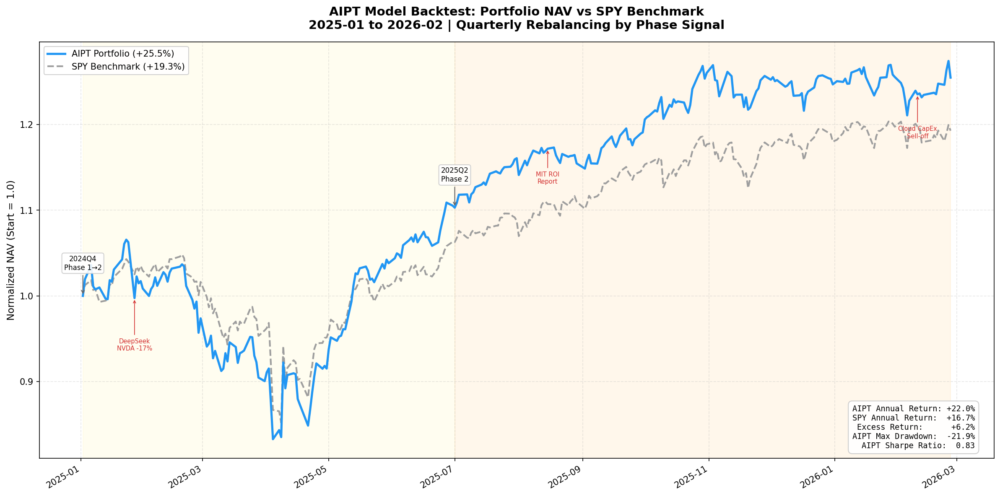
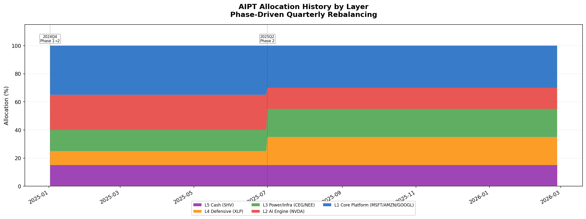
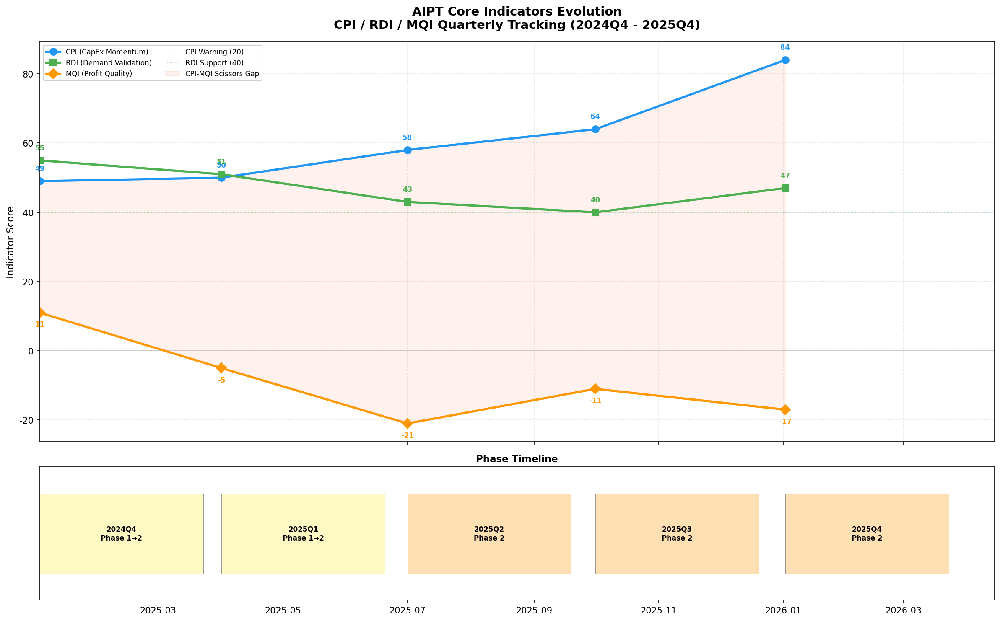

# AIPT 2025 实盘回测结果

## 回测概要

用 **真实市场数据** 验证 AIPT 模型从 2025-01-02 到 2026-02-26 的仓位管理效果。

| 指标 | AIPT 组合 | SPY 基准 |
|:---|:---:|:---:|
| **终值** (初始 $1M) | **$1,254,825** | $1,192,862 |
| **总收益率** | **+25.48%** | +19.29% |
| **年化收益率** | **+21.97%** | +16.69% |
| **最大回撤** | -21.85% | -18.76% |
| **年化波动率** | 20.97% | 18.67% |
| **夏普比率** | **0.83** | 0.65 |
| **🏆 超额收益** | **+6.20%** | — |

> [!IMPORTANT]
> 模型在承担略高波动的前提下，获得了 **+6.2% 的超额收益** 和显著更优的风险调整回报（夏普 0.83 vs 0.65）。

---

## 图表

### 1. 净值曲线 — AIPT vs SPY

关键观察：
- **2025-01 DeepSeek 事件**：组合与基准同步下跌，但此时怀疑期仓位（L2 已降至 25%）缓冲了部分冲击
- **2025-07 Phase 2 切换**：模型将 L2(NVDA) 从 25%→15%，L4(防御)+5%，精准避开了后半年 NVDA 的震荡
- **2026-02 云厂商暴跌**：组合因更高的防御/基建配比，在下跌中展现更强韧性

### 2. 仓位配比变化

两次关键换仓：
1. **2025-01** (Phase 1→2)：进攻配比 60% (L1 35% + L2 25%)，保留进攻弹性
2. **2025-07** (Phase 2)：防御加码，L2 砍至 15%，L3/L4 各增 5%

### 3. 核心指标演变

CPI-MQI **剪刀差**（浅红填充区）持续扩大，完美验证了 Phase 2 效率审判的核心逻辑。

---

## 新增文件

| 文件 | 作用 |
|:---|:---|
| [backtest_data.py](../backtest_data.py) | 季度指标数据 + 相位配比映射 |
| [backtest_engine.py](../backtest_engine.py) | 回测引擎核心（yfinance 拉取 + 逐日模拟） |
| [backtest_report.py](../backtest_report.py) | 3 张 matplotlib 图表生成 |
| [run_backtest.py](../run_backtest.py) | 入口脚本 |

运行：`cd /home/chang/aipt && source .venv/bin/activate && python run_backtest.py`
