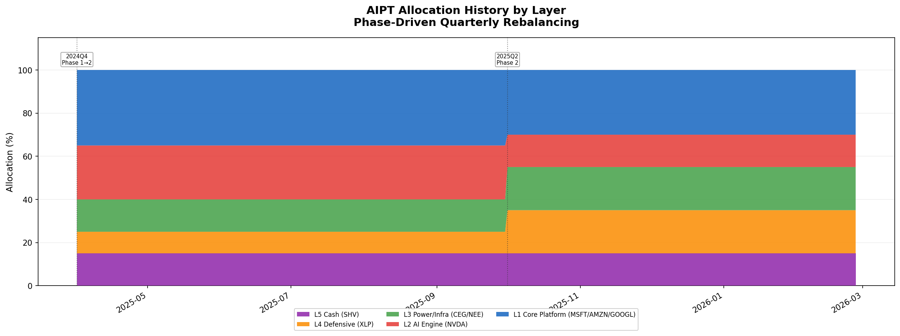
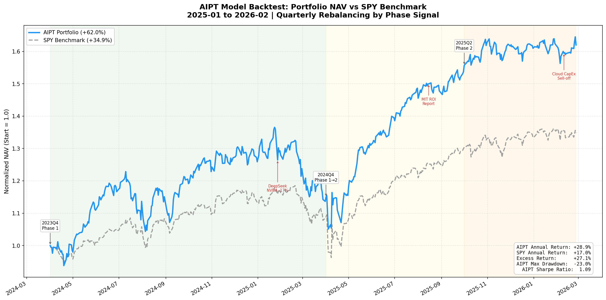
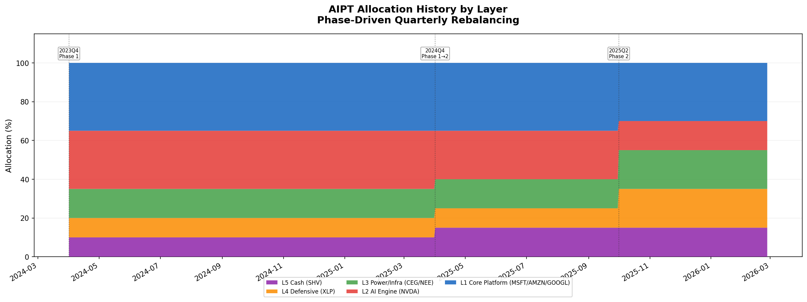
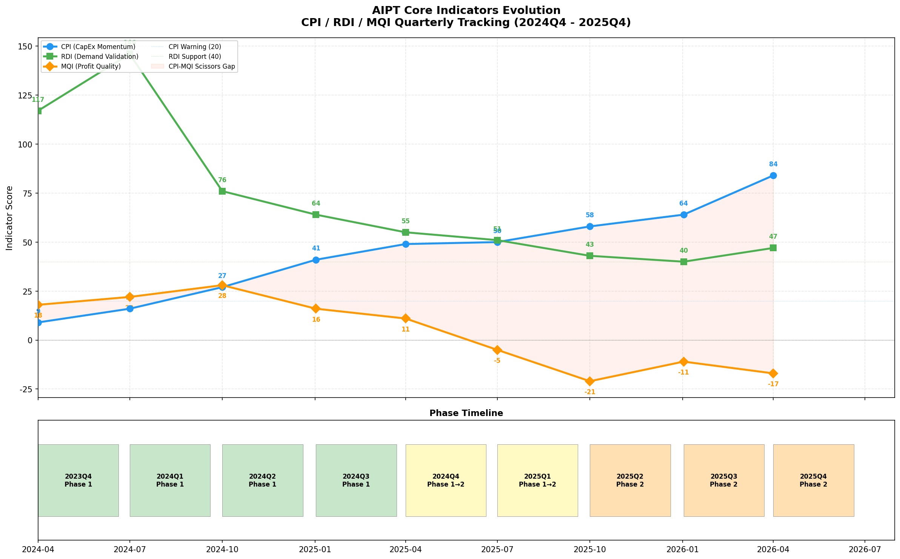

# AIPT 实盘回测结果

用 **真实市场数据**（yfinance 日度价格）验证 AIPT 模型在不同区间的仓位管理效果。

---

## 一、2025-04-01 ~ 2026-02-26

### 回测摘要

| 指标 | AIPT 组合 | SPY 基准 |
|:---|:---:|:---:|
| **终值** (初始 $1M) | **$1,409,216** | $1,239,465 |
| **总收益率** | **+40.92%** | +23.95% |
| **年化收益率** | **+46.10%** | +26.78% |
| **最大回撤** | **-9.01%** | -12.05% |
| **年化波动率** | 19.62% | 19.24% |
| **夏普比率** | **2.12** | 1.16 |
| **🏆 超额收益** | **+16.98%** | — |

> 模型不仅收益大幅领先，回撤还更小（-9.01% vs -12.05%），夏普 2.12 极为出色。

### 相位信号与换仓

| 日期 | 相位 | 关键仓位 |
|:---|:---|:---|
| 2025-04-01 | 🟡 Phase 1→2 怀疑期 | L1=35% L2=25% L3=15% L4=10% L5=15% |
| 2025-10-01 | 🟠 Phase 2 效率审判 | L1=30% L2=15% L3=20% L4=20% L5=15% |

### 图表

#### 净值曲线


#### 仓位配比



#### 指标演变


---

## 二、2024-04-01 ~ 2026-02-26

### 回测摘要

| 指标 | AIPT 组合 | SPY 基准 |
|:---|:---:|:---:|
| **终值** (初始 $1M) | **$1,619,698** | $1,348,538 |
| **总收益率** | **+61.97%** | +34.85% |
| **年化收益率** | **+28.88%** | +17.04% |
| **最大回撤** | -23.03% | -18.76% |
| **年化波动率** | 22.27% | 16.64% |
| **夏普比率** | **1.09** | 0.75 |
| **🏆 超额收益** | **+27.12%** | — |

> 近 2 年跨度下，模型完整捕获 Phase 1 进攻收益并精准切换防御，超额 +27.12%。

### 相位信号与换仓

| 日期 | 相位 | 关键仓位 |
|:---|:---|:---|
| 2024-04-01 | 🟢 Phase 1 巅峰 | L1=35% L2=30% L3=15% L4=10% L5=10% |
| 2025-04-01 | 🟡 Phase 1→2 怀疑期 | L1=35% L2=25% L3=15% L4=10% L5=15% |
| 2025-10-01 | 🟠 Phase 2 效率审判 | L1=30% L2=15% L3=20% L4=20% L5=15% |

### 图表

#### 净值曲线



#### 仓位配比



#### 指标演变



---

## 如何复现

```bash
cd /home/chang/aipt
source .venv/bin/activate

# 指定区间
python run_backtest.py --start 2025-04-01 --end 2026-02-26
python run_backtest.py --start 2024-04-01 --end 2026-02-26

# 默认区间
python run_backtest.py
```

图表输出到 `backtest_output/{start}_{end}/` 子目录。
